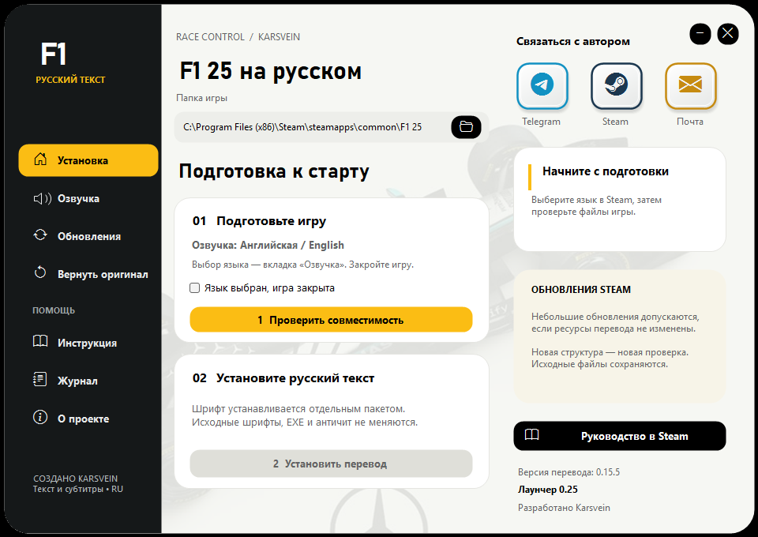

# F1 25 — русский текст и субтитры

**Автор и разработчик: Karsvein · Лаунчер 0.25 · Текст 0.15.5**

[Скачать полный лаунчер 0.25](https://github.com/kasyanovea17-crypto/F1-25-Russian/releases/tag/v0.25) · [Руководство в Steam](https://steamcommunity.com/sharedfiles/filedetails/?id=3800786076)



## Лаунчер 0.25 · русский текст 0.15.5

### Что нового
- **Микрообновления Steam:** вместо привязки только к полному хешу проверяются подпись Electronic Arts и совместимость ресурсов перевода. Посторонние изменения допускаются, если необходимые ресурсы и структура остались прежними.
- **Актуальный откат:** отдельная резервная копия для каждого совместимого обновлённого архива. Возврат оригинала не подменяет новую версию старой.
- **Английская или японская озвучка:** отдельная вкладка выбора и переход к свойствам игры в Steam. Переключение языка нужно подтвердить в Steam и дождаться загрузки; сам выбор в лаунчере не скачивает голоса.
- **Кириллица:** отдельные шрифтовые пакеты для английской и японской основы; в английском варианте согласованы высота букв, базовая линия и строчные начертания.
- **Интерфейс:** контрастное чёрно-жёлтое меню, понятные шаги подготовки и установки.

### Как обновиться
1. Закройте игру и старый лаунчер. Скачайте **F1_25_RU_v0.25_text0.15.5.zip** из Assets и распакуйте **целиком в новую папку**.
2. Откройте Launcher.exe → «Озвучка», выберите English или Japanese. Примените тот же язык в свойствах игры в Steam и дождитесь загрузки.
3. Укажите папку игры → «Проверить совместимость» → «Установить перевод». Запускайте игру через Steam.
4. Язык инженера и комментариев при необходимости выберите отдельно в штатных настройках аудио игры.

**Кнопка «Обновления» старого лаунчера обновляет только текст. Для версии 0.25 нужен полный архив.** Текст 0.15.5 не изменён; это не русская озвучка.

### Границы совместимости и проверка
Базовый профиль — Steam build 25251167 / 1.26.0. Изменение индекса ресурсов, значимых конфигураций, размера архива или исходных шрифтов по-прежнему требует нового профиля. Поддержка всех будущих обновлений не гарантируется.

Исполняемые файлы игры, античит и голосовые банки не изменяются. Выполнено 510 автоматических проверок (181 установка/восстановление, 46 микрообновления, 77 интерфейс, 206 обновление текста), дополнительно проверены прерывание установки и отказ для неподписанной конфигурации. Микрообновления моделировались на изолированных копиях. Сетевая гонка и все сюжетные сцены этой версии отдельно не проверялись.

Автор: **Karsvein**. [Руководство в Steam](https://steamcommunity.com/sharedfiles/filedetails/?id=3800786076).

SHA-256 архива: `9945f5d8b69e0f1abdce6f15ec61ac81bd37d5a997c16d3eb4dac7a3b495c30b`.

## Возврат оригинала
Закройте игру → «Вернуть оригинал» → «Восстановить оригинал». Не удаляйте резервные копии и журнал незавершённой операции. Используются `.f1ru-v24-build25251167` для известной основы и `.f1ru-v25-<SHA256>` для совместимого микрообновления. Старые копии сохраняются. При необходимости используйте «Вернуть оригинал.cmd».

## Обновление текста
«Обновления → Проверить обновления → Обновить перевод» получает только текстовый пакет из этого репозитория, проверяет SHA-256, размер, версию и структуру записей. Код, профили совместимости и шрифты этим каналом не обновляются. Учётная запись GitHub игроку не нужна. Прерванную операцию можно отменить кнопкой восстановления обновления.

## Для разработчика
Windows, .NET Framework 4.x, Windows PowerShell 5.1:

```powershell
powershell.exe -NoProfile -ExecutionPolicy Bypass -File .\build.ps1
```

Результат: `dist/F1_25_RU_v0.25_text0.15.5.zip`. Сборка проверяет хеши payload и запускает 77 UI self-tests. `Compatibility.cs` нужен во время работы установщика и поставляется рядом с `Engine.ps1`. Старые `payload/config.patch` и `payload/fonts_japanese.erp` сохранены для истории, в новую сборку не входят.

Для выпуска следующего текста редактируйте `translations.json`, сохраняя ключи и метки, затем запускайте `python release_text.py НОВАЯ_ВЕРСИЯ "Описание изменений"`. Публикуйте новую папку `updates/НОВАЯ_ВЕРСИЯ` и канал `updates/stable.json` вместе; старые пакеты не перезаписывайте. См. также `README.txt` и `CHANGELOG.md`.

`UpdateTests.cs` содержит тесты текстового обновления на подготовленных фикстурах; `IntegrationTests.cs` — исторический тест прежнего установщика, не проверка актуального профиля 0.25.

## Контакты
[Telegram](https://t.me/Arete_Eudaimonia_Ataraxia) · [Steam](https://steamcommunity.com/profiles/76561198993070335/) · [Почта](mailto:sobesednik617@gmail.com)

Значки — Bootstrap Icons, MIT (`assets/BOOTSTRAP-LICENSE.txt`). Названия, логотипы и иллюстрация болида принадлежат соответствующим правообладателям. Проект не является официальным продуктом EA, F1 или Mercedes.
