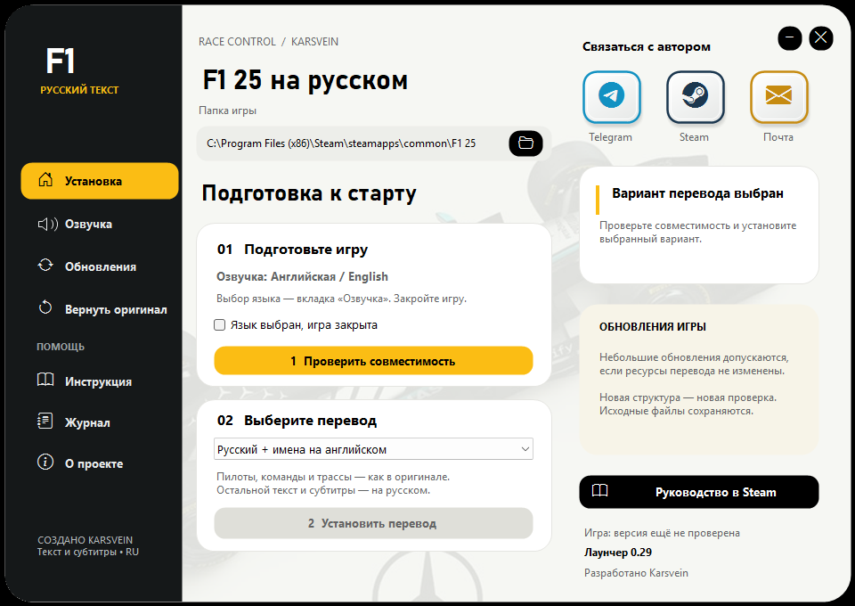

# F1 25 — русский текст и субтитры

**Karsvein · Лаунчер 0.29 · Один комплект для проверенных сборок 1.18, 1.24 и 1.26**

[Скачать лаунчер 0.29](https://github.com/kasyanovea17-crypto/F1-25-Russian/releases/tag/v0.29) · [Руководство в Steam](https://steamcommunity.com/sharedfiles/filedetails/?id=3800786076)



## Что нового
- Проверенные профили 1.18 и 1.24 объединены с существующими профилями Steam/EA 1.26. Отдельные архивы для двух старых версий больше не нужны.
- Кнопка «Проверить совместимость» определяет сборку по файлам и автоматически выбирает соответствующий набор текста. После проверки лаунчер показывает версию игры и текста.
- Для каждой сборки сохранён выбор: **Русский перевод** либо **Русский + имена на английском**. Во втором варианте пилоты, персонажи, команды, трассы и модели остаются как в оригинале; остальной текст и субтитры — на русском.
- Наборы ключей разделены: 1.18 — **56 439**, 1.24 — **55 991**, 1.26 — **56 134**. Текст одной версии не подставляется в другую.
- Установка поверх отдельных проверенных комплектов 1.18/1.24 использует прежние резервные копии. Смена варианта не требует ручного удаления перевода.
- Старые версии и вариант с оригинальными именами обновляются **полным архивом лаунчера**. Обычный текстовый канал для них не применяется. Канал текущего русского текста 1.26 сохранён.

Совместимость относится к проверенным файлам, а не ко всем играм с похожим номером версии. Неизвестный или изменённый нужный ресурс сохраняется без изменений и требует отдельного профиля. Прежняя проверка совместимых микрообновлений Steam/EA сохранена; неизвестный EXE не принимается текстовым обновлятором.

## Установка и обновление
1. Закройте игру и старый лаунчер. Скачайте `F1_25_RU_v0.29_text0.15.5.zip` из Assets и распакуйте **весь архив в новую папку**.
2. В своём клиенте игры выберите English либо Japanese и дождитесь загрузки:
   - Steam: F1 25 → Свойства → Общие → Язык.
   - EA app: Библиотека → F1 25 → Управление → Свойства → Язык.
3. Запустите `Launcher.exe`, укажите настоящую папку F1 25. На вкладке «Озвучка» укажите тот же язык.
4. На вкладке «Установка» выберите перевод, подтвердите подготовку, нажмите «Проверить совместимость», затем «Установить перевод».
5. Запустите игру обычным способом. В настройках аудио проверьте язык радио и комментариев.

Выбор английской/японской озвучки независим от перевода. Лаунчер сохраняет предпочтение, но сам не переключает язык клиента и не скачивает голоса. **Японский язык не обязателен. Это перевод текста, а не русская озвучка.**

При смене папки, перевода или озвучки повторите проверку совместимости. Для перехода с 0.28 на 0.29 нужен полный ZIP: кнопка обновления текста не обновляет сам лаунчер.

## Вернуть оригинал
Закройте игру → «Вернуть оригинал». Либо запустите `Вернуть оригинал.cmd`.
Резервные копии и журнал незавершённой операции сохраняйте до завершения проверки.
`ROLLBACK.sh` — дополнительная Python-обёртка того же движка: `python ROLLBACK.sh "D:\F1 25"`.

EXE, исходные шрифты и голосовые банки не заменяются. Русские шрифты устанавливаются отдельно. Возврат оригинала восстанавливает исходный `game.dat` своей сборки и удаляет добавленные ресурсы перевода.

## Проверки
Установка, оба варианта, повторная установка, переход с отдельных legacy-комплектов, отказ при несовместимых файлах и побайтовый откат проверяются на отдельных копиях. [Подробный отчёт](TEST_REPORT.md).

Запуск реальной игры, отображение во всех сценах, озвучка и онлайн в рамках этого выпуска не проверялись. Поддержка EA app остаётся экспериментальной до проверки на игровом ПК.

## Обновления текста
Канал проверяет SHA-256, размер, номер версии и структуру LNG. Он обновляет только текущий обычный русский текст 1.26; legacy-наборы и оригинальные имена сохраняются. Код лаунчера, шрифты и профили через этот канал не обновляются. Пользователю не нужна учётная запись GitHub.

## Сборка из исходников
Windows, .NET Framework 4.x и Windows PowerShell 5.1:

```powershell
powershell.exe -NoProfile -ExecutionPolicy Bypass -File .\build.ps1
```

Результат: `dist/F1_25_RU_v0.29_text0.15.5.zip`. Проверяются хеши всех восьми payload-файлов и интерфейс. Скрипт не перезаписывает существующие результаты. Для локального полного цикла: `build.ps1 -SkipArchive`, тесты, затем `build.ps1 -PackageOnly`. Упаковка использует явный список файлов и не включает тестовые копии игры.

`GameTextProfiles.cs`, `Compatibility.cs` и `Engine.ps1` входят в комплект. Тесты — `tests/test_unified.py`, `GameTextProfileTests.cs` и `UpdateTests.cs`. Интеграционный стенд использует локальные каталоги образцов, указанные в начале скрипта; образцы игры в репозиторий и ZIP не включаются. Готовый архив можно независимо проверить командой `python verify_package.py PATH_TO_RELEASE_ZIP`.

Для следующего текущего текста: отредактируйте `translations.json`, сохранив ключи и метки, запустите `python release_text.py НОВАЯ_ВЕРСИЯ "Описание"`. Старые пакеты не перезаписывайте. Пересоберите оригинальные имена: `python build_original_names.py PATH_TO_ORIGINAL_ENGLISH_LNG`. Это не обновляет legacy-наборы автоматически: они требуют своей проверки исходников.

## Контакты
[Telegram](https://t.me/Arete_Eudaimonia_Ataraxia) · [Steam](https://steamcommunity.com/profiles/76561198993070335/) · [Почта](mailto:sobesednik617@gmail.com)

Значки — Bootstrap Icons, MIT (`assets/BOOTSTRAP-LICENSE.txt`). Названия, логотипы и иллюстрация болида принадлежат соответствующим правообладателям. Проект не является официальным продуктом EA, F1 или Mercedes.
